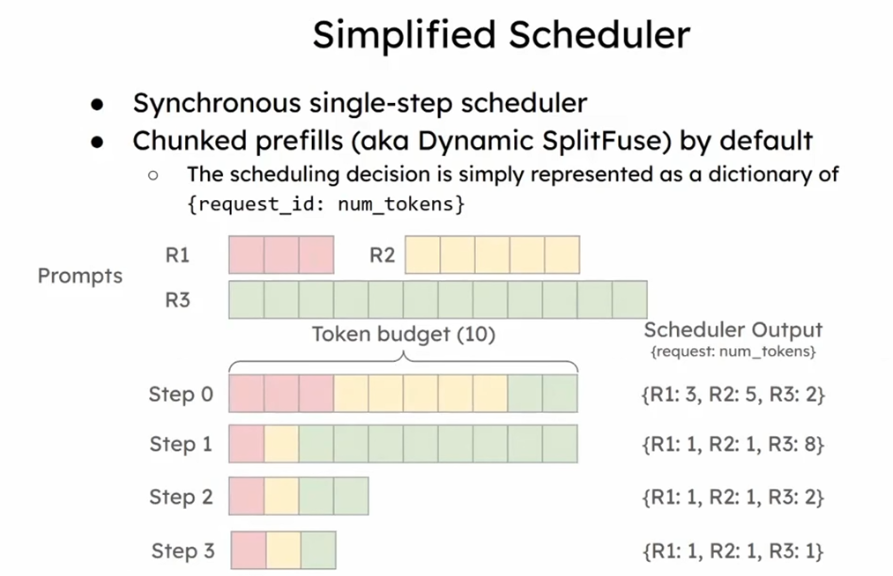
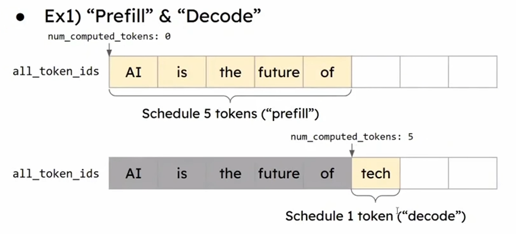
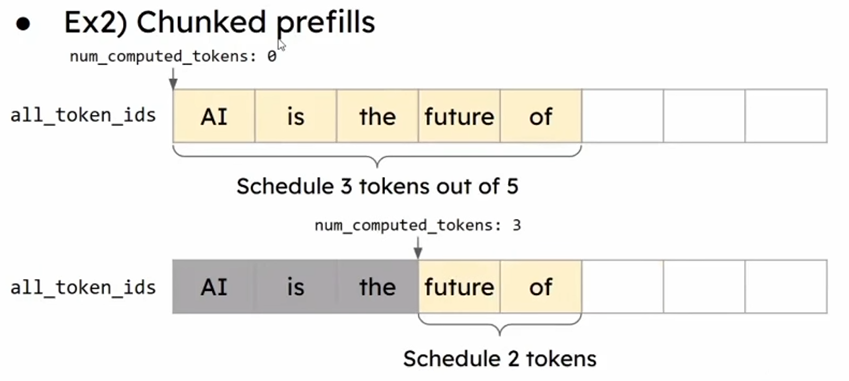
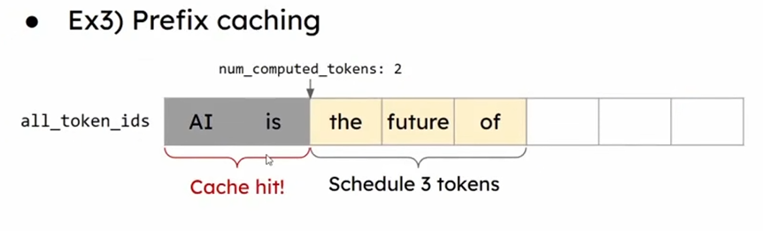
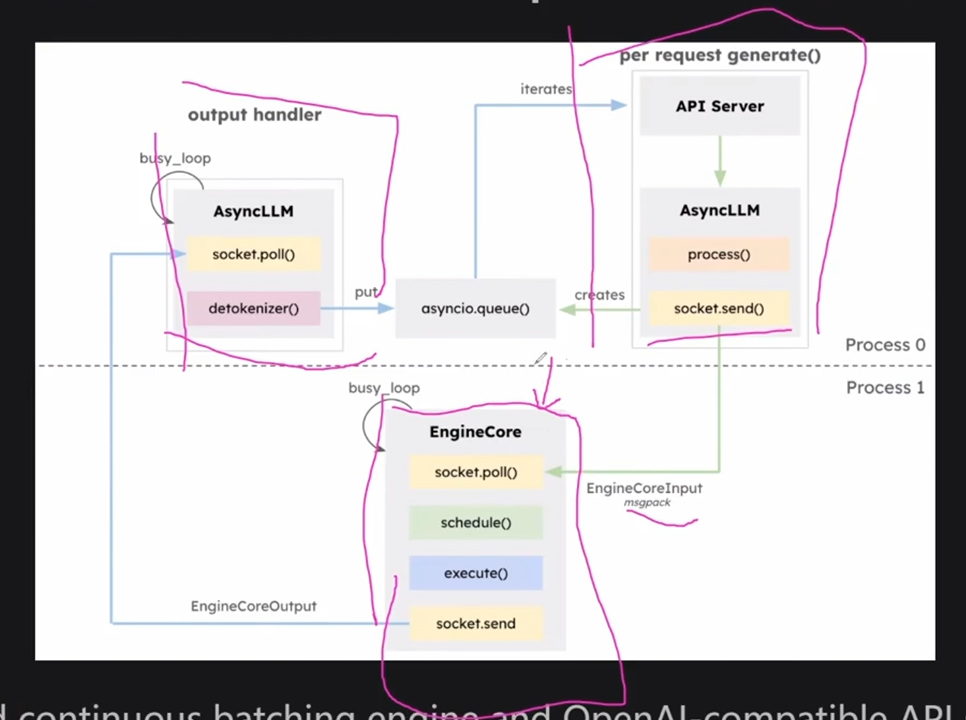
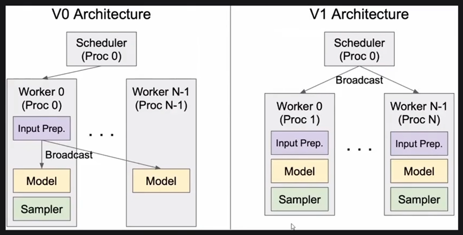

* Source: https://www.youtube.com/watch?v=uclfcBc8hPE  

* Start with `vllm/examples/offline_inference/basic/basic.py`  
* Huggingface 是各种LLM模型的hub  

## vLLM代码库
### 模块
* FE: LLM, API Server
    * Path: `vllm/entrypoints/`
        * for offline inference: LLM: `./llm.py`
        * for online serving: API Server: `./openai/api_server.py`
            * FastAPI routes requets to FE functions
* BE: Engine 是vLLM的主要功能
    * Path: `vllm/engine/`
    * `./llm_engine.py` 是真正的(同步)逻辑所在
    * `./async_llm_engine.py` 是套了一层异步逻辑，可看做llm_engine的agent/proxy
* Core modules:
    * Path: `vllm/core/`
    * Scheduler: `./scheduler.py`
        * 作用：每个step中准备一个request batch，放什么requests提交给engine出处理
            * step: 一次inference，就是说一个字token
        * 现有系统orca在打包的过程中对GPU内存的利用率不足
            * 问题：preallocate continuous memory
            * 于是引入了 kv cache manager来对gpu内存进行更细粒度的管理
    * KV cache manager: `./block_manager.py`
        * 核心: Paged Attention
    * Evictor: `./evictor.py`
        * preempt 机制所在：request使用GPU内存的swapper
        * prefix/history caching: request间复用相同的前缀
            * what if prefix doesn't match: `CacheBlend`
            * what if prefix cache on another machine: `cache sharing across nodes`
        * KV cache optimization
            * DeepSeek (MLA: multi layer attention 浓缩版的attention)
* Worker
    * 各种硬件的抽象：GPU worker, CPU worker, TPU worker, XPU worker, HPU worker, etc.
    * Path: `vllm/worker/`
    * 作用：为Model的运行初始化一些列的环境，例如分布式环境等
    * WorkerBase: `worker_base.py`
        * 作用：所有worker的基本抽象
    * Worker: `worker.py`
        * 作用：衍生出的真正干活的牛马类，默认使用GPU
        * 最简单，focus在这个worker而不是其他硬件worker，否则各种奇怪的问题。。。

* Model Executor (Model Runner)
    * 作用：模型包了一层壳，应该是model运行的runtime manager
    * Path: `vllm/model_executor/`
    * models: `./models/`
        * 作用：各种模型的实现
        * 最重要的模型：`./llamma.py`
            * 里面的265行的`forward()`函数是经常需要碰到的函数
    * Modelling
        * 作用：把Huggingface上面，`vllm/model_executor/models/` 下面等千奇百怪的模型，改造成vLLM可以execute的过程

* Attention backend
    * 作用：真正实现了Attention的地方
    * Path: `/vllm/attention/backends/`
    * Flash attention: `flash_attn.py`
        * 优化softmax，采用递归的方式计算两两token之间的关系
        * 否则n个token需要计算n**2的复杂度计算两两token之间的关系，非常占用内存和计算资源
        * prefill是处理输入input tokens，decode是生成一个一个output token
        * 771行 kernel `flash_attn_varlen_func()` 不需要从GPU拿任何data
        * 824行 kernel `flash_attn_with_kvcache()` 从paged memory拿data来进行计算

### vllm
[LMCache](https://github.com/LMCache/LMCache/)
[vllm production statck](https://github.com/vllm-project/production-stack)
* vllm上k8s

### Feature
* Distributed communication/inference
    * Why distributed inference?
        * reason: 
            * 一张GPU内存无法把一个大一点的model的parameters放下。
            * 现在同时考虑充分利用计算资源。prefill阶段是一个计算密集型的任务(而decode阶段则是一个内存密集型的任务)因而有了更先进的分布式 Prefill/Decode disaggregation
        * Communication device (需要知道这些细节吗)
            * NVLink: direct GPU-to-GPU communication within a single node. ~900GB/s
            * Infinity Band: High-speed inter-node communication. ~200-400Gb/s
                * for multi-node distributed training/inference wehre nodes need to exchange gradient or activations
            * RDMA: Remote direct memory access bypass OS / zero copy and is the technique that can be implemented
                * over inifinity band which has native rdma support -> high-end cluster like NVIDIA DGX 
                * over layer 2 (ethernet), i.e., RoCEv1 or layer 3 (ip), i.e., RoCEv2 -> needs RDMA-capable NICs on both ends + lossless Ethernet
                * over layer 4 TCP/IP defined by iWARP protocol (software-based)
        * Communication library: `vllm/distributed/device_communicators`其实讲的是两个进程
            * `PyNccl`: communication between NVIDIA hardware for `GPU-to-GPU` tensor transfers (CUDA IPC, NVLink)
            * `shared memory` is the CPU-based inter-process communication (IPC) for synchronization flags/control msgs/metadata exchange
                * within single node, each `GPU worker process` is a standalone OS process (with isolated address space). OS provides a memory segment so that all processes can access for the GPU worker processes to exchange metadata/control signals efficiently
                ```python
                    # Conceptual example in vLLM
                    # Process 1 (GPU 0) and Process 2 (GPU 1) both map the same memory region
                    shm = shared_memory.SharedMemory(name="vllm_metadata", create=True)
                    # Both can read/write without serialization or network overhead
                ```
            * `custom allreduce`: A kernel just for all reduce operation on exchanging/broadcasting tensor data.
                ```
                Before:
                    0 machine: [0]
                    1 machine: [1]
                    2 machine: [2]
                    3 machine: [3]
                After:
                    0 machine: [0, 1, 2, 3]
                    0 machine: [0, 1, 2, 3]
                    0 machine: [0, 1, 2, 3]
                    0 machine: [0, 1, 2, 3]
                ```
            * `torch.distributed`
                * Refer to doc: [torch.distribute.md](./torch.distributed.md)
            * `GroupCoordinator` exists in every worker process. All the group coordinator works together as a decentralized group.
                * It's a wrapper of pytorch ProcessGroup
                * rank: 对进行分布式计算的程序的编号。如果TP=2，PP=4，那么我们需要2x4=8个worker进程，那么我给每个worker进程一个编号就是rank 0-7
                * local_rank: 分配给当前worker process的本地可用GPU在本机编号
                * rank_in_group：分配给当前worker process的本地可用GPU在group中的全局编号
                * cpu_group: 同步可控性比gpu更高，基于cpu的通信能够让几个worker process在barrier下同步等待
                * device_group: 
            * Algorithm-side
                * TP: how is it implemented within `flash_attn.py`
                * `vllm/model_executor/models/llama.py`
                    * class `LlamaAttention` divides `heads` aross `tp_size`
    * 传统的Type of distributed inference: TP / PP/ EP / DP
        * TP: tensor parallel
            * what: 单个layer内部并行计算张量运算。把模型的weights，按照GPU的个数拆成相应份，同时进行计算，然后将所有GPU的结果汇总，得到下一个layer的输入。是一个横向切layer的并行计算
            * why: 解决的是单层太大，一张卡的内存不足以容纳整个parameters
            * Path for communication data structure: `vllm/distributed/parallel_state.py`
                * 740行的`_TP: GroupCoordinator`是vLLM进行分布式通信，932行`init_model_parallel_group()`进行初始化
                * `GroupCoordinator`不仅需要考虑TP，还要考虑PP(Pipeline Parallel)，以下是chatgpt的描述
                    ```
                    对一个 token 来说：
                        Token t:
                        PP stage 0:
                            ├── TP rank 0 compute slice
                            ├── TP rank 1 compute slice
                            └── all-reduce
                        send hidden state →
                        PP stage 1:
                            ├── TP rank 0
                            ├── TP rank 1
                            └── all-reduce
                        👉 GroupCoordinator 必须知道：
                            * 哪些 rank 属于同一个 TP group
                            * 哪些 rank 属于同一个 PP stage
                            * PP stage 之间的顺序
                            * TP group 内的 collective 同步点
                        如果不知道这两层结构，就无法正确调度 token 的执行路径。一句话总结：
                        * PP 是在 layer 维度并行（切模型结构），
                        * TP 是在 layer 内部按张量维度并行（切计算），
                        * token 永远是“穿过”TP 和 PP 的执行实体，而不是被切分的对象。
                    ```
        * PP: pipeline parallel
            * what: 
            * why: 解决的是层次太多的问题，区别于TP解决的是单层太大的问题。是纵向切model block，将layer派发到不同GPU进行计算。
            * cons: cannot improve latency. For a single request, you don't save time in any of its layers of steps.
                * Compared with tensor parallel, tensor parallel improves latency.
                * Used in cheap hardware for easier deployment and higher throughput
            * Algorithm-size:
                * worker in charge of a subset of layers
                    * Path: `vllm/model_executor/models/llama.py`
                    * self.start_layer --> self.end_layer scopes the layers handled by the worker
                    * between workers: communicate `IntermediateTensor`
                    * pipeline parallel
                        * Path: `vllm/worker/model_runner.py`
                        * `get_pp_group()`
        * EP (Expert parallel)
            * why EP: 
                * Mistral/Mixtral/deepseek model: Mixure of Experts (MoE)
                    * Only applies to the linear layers not attention layer
                    * Normal process: all weights participate in computation
                    * MoE: expert as granularity, only a small subset of experts participate the computation, the subset of expert may be different between request.
                        * about only 5 experts (The most possible output gets the weights, the other weights are 0)
                * Place differet experts onto different GPUs --> expert parallel
                * Algorithm:
                    * Context: the matrix is sparse, so we just need to focus on the most significant part of data
                    * Expert parallel:
                        * Shuffle (deepep communication kernel)
                        * Forward
                        * Shuffle back
                * TP is for attention, and EP is for linear layers
                * Shared expert will have high load --> duplicate shared expert ? 
        * DP (data/request parellel)
            * reason: max tp# << ep# needed
            * tp < # attention head
            * tp * dp == ep (ep = 320 process, but tp may be 20 parallelity, then we parallelize data/request)
            * 就是ep的并行度能力远大于tp的并行度能力，于是提供在数据层面的并行度，来充分利用ep的并行处理能力
            * Difficult to implement in paractice: 
                * request padding to avoid deadlock
    * PD Disaggregation
        * KV cache

        * Prefill and Decode
            * Prefill: process input prompts to generate kv cache
                * Time O(n**2), n: #tokens
                * Path: `llama.py` `forward(): qkv_proj() -> qkv.split() -> rotary_emb() -> attn()`
            * Decode: generate output tokens
                * Time O(n)
            * reason
                * 短板理论：prioritize prefill
            * problem: prefill step takes time and pauses decoding steps of other requests
                * Solution: 
                    1. PD disaggregation
                        * put prefill to one GPU and the decode to the other GPU
                        * XPXD, XPYD
                            * XPXD: prefill nodes == decode nodes
                            * XPYD: dynamic configure p nodes and d nodes
                    2. Chunked prefill ? 
                        * Treat prefill and decode as the same operation
                        * Design operator that accepts either shape of operations (prefill: matrix multiplication, decode: vector x matrix)
                        * preferred by sheduler that only cares about token x job mapping。每个job跑多少个token。without caring about either prefill or decode
                            * v1 scheduler got simplified a lot because of this
                            * chunk size matters when batch prefill and decode in a single batch
                                * too large chunk size will cause too many prefill work and delay decoding
                                * too small chunk size increases the generation speed but the hardware utilization down
                        * GPU temporary memory buffer proportional to context length, so lots of context tokens would oom
            * Question 1: How to transfer KV cache from p nodes to d nodes?
                * 2 modes: pooling mode and p2p mode
                    * pooling mode: producer/sender -> pool -> consumer/receiver
                        * pros: easier impl decoupling the sender/receiver when relations complex like multiple sender and multiple receiver
                    * p2p mode: sender <-> receiver knows each other
                        * pros: direct transfer to receiver than writing to pool then writing to receiver
                    * implementation
                        * LMCache: implements both
                        * Other impl
                            * MoonCake implements pooling mode
                            * NVIDIA NIXL: implements p2p mode, uses UCX more general data tansfer
                        * All these works as a library for vLLM to use
            * Question 2: How to extract and inject KV cache from/to vLLM?
                * Connector API
                    * Path: `vllm/distributed/kv_connector/simple_connector.py`
                * called by model_runner in `llama.py`
                    * model runner that wraps the underlying model and prepares the needed inputs
                        - Before model forward: `get_kv_transfer_group().recv_kv_caches_and_hidden_states()`
                            * Inject KV cache into vLLM's paged memory
                            * Check if there's kv cache for the input tokens, if there's the update the input token states to reflect the truth before logic flows to scheduler.
                        - model forward
                        - Afer model forard: `get_kv_transfer_group().send_kv_caches_and_hidden_states()`
                            * Extract kv cache from vLLM's paged memory and send it to external 
            * Question 3: When to send request to P node and D node?
                * Original flow: request --> single instance to handle P and D
                * Now flow: request --> P and D instances
                    * design 1: request -> router -> P node -> router -> D node
                    * design 2: request -> D node -> P node -> D node

## vLLM v1
* Why V1?
    * v0 is slow (CPU overhead)
    * v0 code is hard to read and dev
* Scheduler 
    * Path: `vllm/v1/core/sched/scheduler.py`
    * Simplified scheduling: chunked prefill by default
        * Refer to 
        * `{r: delta_token}` describes the number of extra tokens than last `step`
        * unifies prefill and decode 
            * originial prefill and decode step: 
            * now chunked prefill step: 
            * prefix caching step: 
* General architecture
    * Scheduler, API Server, EngineCore in separate processes: 
        * They use ZMQ msgpack for inter-process communication
        * Refer to this blog [vLLM V1: A Major Upgrade to vLLM's Core Architecture](https://blog.vllm.ai/2025/01/27/v1-alpha-release.html)
    * Scheduler and worker in separate process
        * V0: scheduler and Rank 0 worker co-locate in the same process
        * V1: scheduler in a separate process. So each worker program follows strictly SPMD(same program multiple data): 
        * So for communication with GPU worker, vLLM use Ray?
    * microservic?
        * microservice sacrifices communciation for higher scalability. State is scattered among each microservice than centralized.
        * However, LLM has a very large kv cache and needs a very fast communication among modules. It needs a higher communication than scalability.
        * In the future, we may see the introduction of microservice in the LLM area when service grows too large to handle centrally
        * PD disaggregation shows an early form of microservice, which separates the P service and D service
* Worker
    * Persistent batching
        * We only send the delta of the GPU batch tensors from CPU
    * Piecewise cudagraph
* Attention kernel
    * Simplified configuration
    * Cascade inference

* Multi-modal
    * Embedding as the new KV cache reference
    * KV cache management (incoming)
        * Hybrid memory allocator

## Misc
* 系统中处理复杂问题的方式就是抽象，就是可迁移到具体问题的更高层本质规律
* 一个成功的人生阶梯就是从这一个阶段的好的project进入到下一个好的project
* Microsoft foundry vs vLLM vs DeepSpeed
    ```
        Foundry: 产品/商业层
        ↓
        vLLM/TRT: 平台调度层
        ↓
        DeepSpeed/ZeRO: 模型/算法层
    ```
    * Foundry：“能不能对外卖”
    * vLLM：“算得是否高效”
    * DeepSpeed：“能不能算”